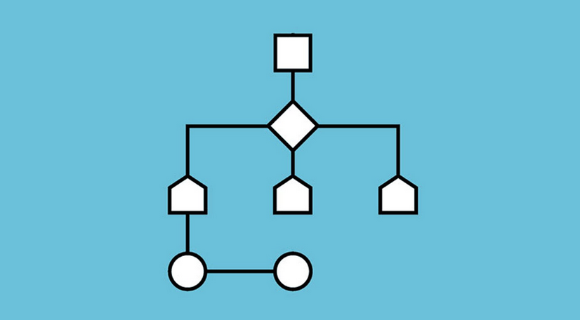
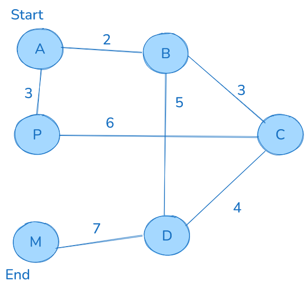
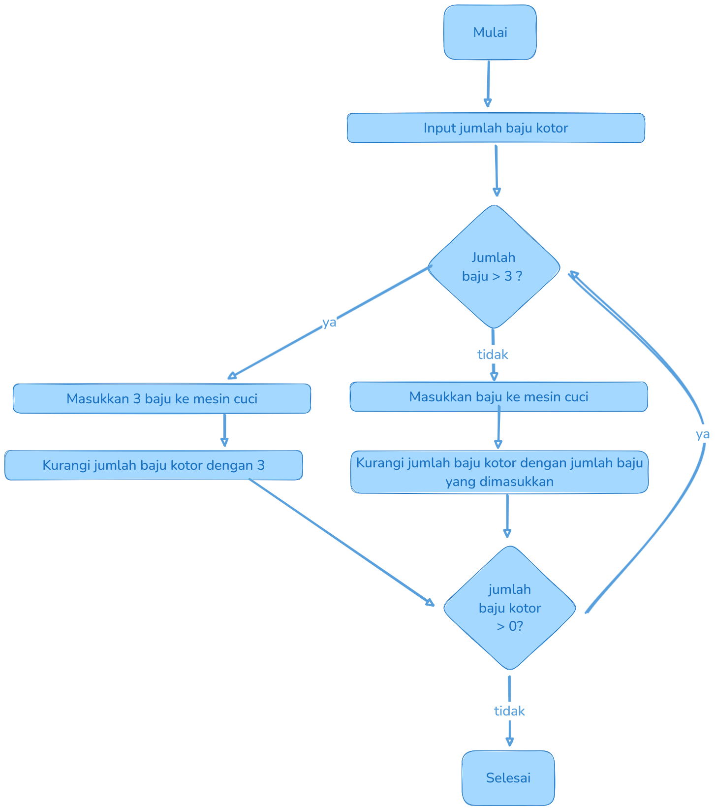

# Belajar Algoritma

Tujuan menjadi programmer adalah memecahkan masalah. Menjadi programmer bukan berarti hanya menulis kode, tapi juga memecahkan suatu masalah dunia menggunakan solusi IT. Kode hanyalah tools untuk programmer berbicara dengan komputer, otak sebenarnya untuk masalah tersebut ada di programmer itu sendiri. Masalah-masalah ini perlu di pecah menjadi pecahan kecil oleh seorang programmer dan merancang bagaimana alur untuk memecahkan masalah tersebut, nah proses merancang pemecahan masalah itulah yang memerlukan algoritma

Seorang programmer akan berfikir keras untuk membuat algoritma agar menyelesaikan masalah yang mereka temukan. Algoritma ada banyak macamnya, setiap masalah IT bisa di solve dengan berbagai kombinasi algoritma. 

Banyak sekali orang yang menyepelekan materi algoritma ini, terlihat seperti remeh dengan flowchart flowchart asal asalan atau algoritma deskriptif yang menyusahkan programmer. Tapi sebenarnya, justru algoritma adalah kunci utama dalam otak seorang programmer

Ngoding tanpa algoritma itu bisa bisa saja, tapi apakah hasilnya akan efektif ? ya tentu tidak. Ngoding dengan sekedar menghafalkan syntax tidak akan bisa menyelesaikan suatu permasalahan nyata. Ini menjadi alasan mengapa memahami algoritma adalah fondasi dari seorang programmer yang baik.

# Kenapa ? 
Coba pecahkan masalah mencari jarak terdekat ini secara otomatis menggunakan kepala kalian sendiri. 



jelas pertanyaan ini tidak bisa di selesaikan tanpa ada fondasi algoritma atau logika berpikir yang baik.

ini menjadi urgensi seberapa pentingnya pemahaman terkait algoritma itu sendiri

# Algoritma
Algoritma adalah urutan langkah-langkah yang sistematis dan terdefinisi dengan jelas untuk menyelesaikan suatu tugas atau masalah. Algoritma sangat penting dalam dunia ilmu komputer dan matematika, serta menjadi dasar dari teknologi modern

Konsep algoritma sendiri sudah ada sejak jaman prasejarah. Misalnya matematikawan babilonia kuno yang menggunakan algoritma aritmatika, seperti algoritma divisi sekitar tahun 2500 SM. 

Algoritma pertama kali ditemukan oleh Muhammad Ibn Musa al-Khawarizmi, seorang ilmuwan Muslim yang ahli dalam bidang Matematika, Astronomi, Astrologi, dan Geografi. Al-Khawarizmi lahir di khwarezmi (yang lebih dikenal uzbekistan) sekitar tahun 780. Ia menulis buku tentang bilangan Hindu-Arab dalam bahasa arab yang kemudia diterjemahkan ke dalam bahasa latin dengan judul "Algoritmi de numero indorum". Kata latin "algoritmi" inilah yang diterjemahkan ke dalam bahasa inggris sebagai "algorithm"

jadi jangan lupakan kontribusi dan berterima kasihlah kepada ilmuwan-ilmuwan terdahulu yang membukakan kita gerbang menuju teknologi modern seperti ini 

Sebelum menulis algoritma dalam bentuk kode, kita perlu belajar menulis kode dalam bentuk deskriptif yang selanjutnya akan disebut sebagai <b>Pseudocode</b>

penulisan algoritma bertujuan untuk yang baru belajar untuk menyalurkan beban otak ke dalam nota algoritma, yang mana itu akan membantu kamu dalam visualisasi suatu proses logika pemrograman

contoh pseudocode

```
cara memasukan baju ke mesin cuci
misal mesin cuci hanya muat 3 baju saja
lalu kita butuh mencuci 4 baju

langkah awal
kita masukan 3 baju sekaligus ke mesin cuci tersebut
kalau kita memasukan 4 baju sekaligus maka akan ada peringatan dari mesin cucinya

lalu kalau sudah memasukan 3 baju atau kurang dari itu
baju yang kotor dikurangi baju yang masuk ke mesin cuci tersebut

lalu lakukan hal tersebut sampai baju kotornya habis
```

berikut adalah contoh alur dari algoritma tersebut 



Tanpa sadar kita sudah menulis algoritma di kehidupan kita sehari-hari seperti saat kita menulis apa tugas yang ingin kita kerjakan atau aktifitas apa yang ingin dikerjakan.

## Algoritma dasar Pemrograman
Sekarang akan dijelaskan contoh implementasi dalam pemrograman.

Katakanlah saya ingin membuat sebuah kode yang mengecek sebuah angka apakah itu genap atau ganjil. 

Secara intuitif pasti yang terpikir adalah seperti berikut: 
- Menggunakan operator modulo (%) untuk mengecek sisa hasil bagi
- jika sisa bagi dengan 2 adalah 0, maka angka tersebut adalah genap, jika tidak maka ganjil 

sekarang kita perlu mengkonversi pondasi algoritma tersebut menjadi, flowchart agar visualisasi algoritmanya terlihat jelas.

### Flowchart 
flowchart atau diagram alir adalah representasi alur dari suatu algoritma dari awal sampai akhir 

berikut adalah beberapa komponen utama atau simbol atau notasi dalam flowchart:


kenapa kita perlu pakai flowchart ? 
- mudah memvisualisasikan logika program
- memudahkan pemahaman proses
- membantu menemukan kesalahan dalam proses
- dokumentasi sistem atau program
- alat komunikasi antara programmer dan user

apa wajib pakai flowchart ? ya nda juga, cuman flowchart akan membantu mempermudah proses berpikir kalian dan pengembangan algoritma kalian.

nah setelah sedikit yapping diatas, berikut adalah contoh flowchart dari algoritma pengecekan genap ganjil 


setelah membuat flowchartnya, kita bisa lebih mudah dalam mengaktualisasikannya di dalam kode program

``` javascript
function genapGanjil(angka){
    if(angka % 2 == 0){
        return "Genap"
    } else{
        return "Ganjil"
    }
}

console.log(genapGanjil(2)) // Output :: "Genap"
console.log(genapGanjil(1)) // Output :: "Ganjil

```

pertama, membuat fungsi untuk mengecek genap ganjilnya sebuah angka yang akan menerima suatu parameter, parameter tersebut adalah angka, dan dibuat sebuah pengkondisian, dimana kondisi tersebut akan mengecek apabila angkanya habis dibagi 2 maka akan mengembalikan nilai genap dan ganjil apabila tidak habis dibagi 2 


## Algoritma Lanjutan
Pasti kalian pernah dengar beberapa algoritma seperti Djikstra algorithm, Sorting Algorithm, Searching, dan lainnya. Algoritma ini adalah implementasi spesifik dari suatu permasalahan yang dihadapi. tidak seperti algoritma pengecekan ganjil dan genap yang sudah memiliki rumus pasti, algoritma algoritma lanjutan dapat dicustom atau disesuaikan sesuai kebutuhan atau permasalahan yang sedang dihadapi

### Djikstra Algorithm 
Algoritma ini biasanya digunakan untuk mencari shortest path atau jalur terdekat dalam sebuah graph, dan berikut adalah contoh penerapannya: 
- Fitur rute tercepat google maps
- Jaringan internet mencari jalur terpendek untuk mengirim data
- Game mencari jalan terpendek untuk karakter bergerak
### Sorting Algorithm
Algoritma sorting atau algoritma mengurutkan data, seperti namanya ya gunanya untuk mengurutkan data. Sorting algorithm memiliki beberapa jenis seperti, Bubble sort, merge sort, quick sort dll 
- Mengurutkan daftar nama
- mengurutkan harga terendah hingga tertinggi
- Mengurutkan nilai siswa

### Searching Algorithm 
Algoritma untuk mencari suatu data.
seperti: 
- Mencari kontak di HP
- Mencari produk di e-commerce
- Mencari file di komputer

Kenapa perlu mengenal algoritma lanjutan ? 

Efisiensi, setiap algoritma memiliki kelebihan dalam situasi tertentu
Optimasi, Memilih algoritma yang tepat akan menghemat waktu proses, menghemat penggunaan memori, meningkatkan performa aplikasi
Problem solving, Algoritma-algoritma ini adalah solusi teruji untuk masalah umum.

Dengar memahami algoritma dasar, kalian akan lebih mudah memilih dan mengimplementasikan algoritma-algoritma yang lebih kompleks ini sesuai kebutuhan dalam pengembangan aplikasi kalian. 

---
Link video materi : Menyusul