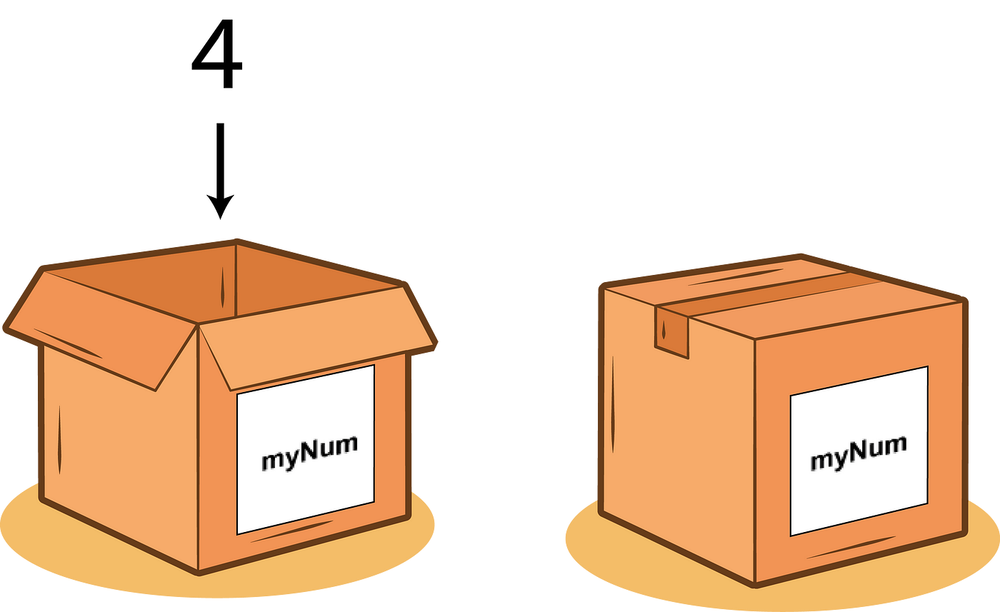

# Sintaks Dasar Javascript
Pada saat ini kita akan belajar dasar pemrograman dengan menggunakan bahasa javascript, sekali lagi kuingatkan bahwa bahasa apapun yang kalian gunakan itu tidak berpengaruh, yang penting ialah konsep pemrograman yang harus kalian pahami dengan baik, yang membedakan bahasa pemrograman itu cuman di sintaks.

Apa itu sintaks ? kalau di analogikan di pembelajaran bahasa manusia, kan kita mengenal dengan istilah grammar, atau tata cara bagaimana kata itu ditulis. Nah dalam bahasa pemrgoraman sintaks itu sama saja dengan grammar. Menulis bahasa dengan grammar yang acak acakan tidak akan membuat lawan bicara kita mengerti apa yang ingin kita sampaikan, begitu juga dengan komputer, menulis sintaks yang asal asalan akan membaut komputer sebenarnya yang mau kita sampaikan itu apa.

# Variabel 
Variabel adalah tempat untuk menyimpan data atau nilai yang bisa digunakan dan diubah selama program berjalan. 

Ilustratsi apa itu variabel:


nah dalam javascript kita dapat mendeklarasikan variabel dengan 3 cara yaitu: 

1. Menggunakan `var` atau global variabel

```javascript
var nama = "Amek"
var umur = 25
```
2. Menggunakan `let` (gunakan ini untuk variabel yang nilainya bisa dirubah)
```javascript
let skor = 0
skor = 10 // nilai dari skor berubah menjadi 10 yang awalnya 0
```
3. Menggunakan `const` (gunakan ini unutk variabel yang bernilai tetap/konstan)
```javascript
const pi = 3.14
pi = 3 // nilai tidak akan berubah
```

ada beberapa hal yang penting untuk kalian ketahui mengenai variabel pada javascript yang juga beberapa aturan ini berlaku di bahasa pemrograman lainnya yaitu: 

- Variabel dapat menyimpan beberapa tipe data seperti : String, number, boolean, array, object, dll 
- Nama variabel harus dimulai dengan huruf, underscore (_), atau dollar sign
- variabel bersifat case-sensitive, artinya `nama` dan `Nama` adalah dua variabel yang berbeda
- gunakan nama yang kontekstual untuk memudahkan programmer dalam memahami kode dan fungsi suatu variabel

Contoh penggunaan dalam konteks nyata 

```javascript
let totalHarga = 0
const Pajak = 0.1

function hitungTotal(harga){
    totalHarga = harga + (harga * Pajak);
    return totalHarga
}
```

mungkin kalian akan bingung mana yang sebaiknya digunakan untuk variabel yang datanya sering berubah, apakah `var` atau `let` ?

Sekarang, kita akan belajar yang namanya `variabel scope`

variabel scope sendiri adalah konsep yang menentukan dimana sebuah variabel bisa diakses dalam kode. Ada dua tipe utama scope yaitu: 

1. Global Scope 
```javascript
// variable global dapat diakses darimana saja 

var globalVar = "Bisa diakses dimana saja "
let globalLet = "Ini juga global";

function contohFungsi(){
    console.log(globalVar) // bisa diakses 
    console.log(globalLet) // ini juga bisa diakses 
}
```

2. Local/Function Scope 
```javascript
function contohFungsi(){
    var lokalVar = "Hanya dalam fungsi"
    let lokalLet = "Juga hanya dalam fungsi"

    console.log(lokalVar) // bisa diakses
    console.log(lokalLet) // bisa diakses
}
console.log(lokalVar) // tidak bisa diakses
console.log(lokalVar) // tidak bisa diakses
```
3. Block Scope (Khusus untuk let dan const)
```javascript
if (true) {
    let blockLet= "Hanya dalam block ini"
    const blockConst = "Juga hanya dalam block"
    var blockVar = "bisa diakses diluar block" // var tidak mengenal block scope
}

console.log(blockLet) // error
console.log(blockConst) // error
console.log(blockVar) // bisa diakses
```

perbedaan penting antara var let dan const dalam hal scope: 

```javascript
//Var bisa diakses sebelum deklarasi (hoisting)
console.log(varVariabel) // bisa diakses namun akan mengeluarkan undefined
var varVariabel = "test"

//sedangkan let dan const tidak bisa diakses sebelum deklarasi
console.log(letVariabel) // error
let letVariabel = "test"
```
Tips penggunaan scope 

- Hindari penggunaan variabel kecuali memang diperlukan
- Gunakan let dan const daripada var untuk kontrol scope yang lebih baik
- Perhatikan scope saat bekerja dengan closure dan fungsi bersarang

Penting untuk memahami scope agar bisa : 
- Menghindari konflik nama variabel
- Mengontrol akses data
- Menulis kode yang lebih aman dan mudah dipelihara

# Logging
Logging dalam javascript adalah cara untuk menampilkan informasi, data atau pesan untuk keperluan monitoring dan debugging 

1. console.log() - Paling umum digunakan 

```javascript
console.log("Pesan biasa")
console.log("User:", {Nama: "Budi", umur:25})
```
2. console.error() - Untuk menampilkan error 

```javascript
console.error("Terjadi kesalahan")
```

3. console.warn() - Untuk menampilkan peringatan 
```javascript
console.warn("Peringatan: Data belum lengkap")
```

4. console.info() - untuk informasi

```javascript
console.info("Aplikasi berhasil dimuat")
```

5. console.table() - menampilkan data dalam bentuk tabel

```javascript
const users = [
    {nama: "Budi", umur: 25},
    {nama: "Ani", umur: 23}
]

console.table(users)
```
6. console.log() - mengelompokkan log
```javascript
console.group("User detail")
console.log("Nama: Budi")
console.log("Umur: 25")
console.groupEnd()
```

7. console.time() dan console.timeEnd() - mengukur waktu eksekusi

```javascript
console.time("Loop")
for(let i = 0; i < 10000; i++){
    console.log(i)
}
console.timeEnd("loop")
```


Tips penggunaan logging: 
- Gunakan logging yang sesuai dengan konteks 
- Hindari meninggalkan console.log di kode yang telah masuk tahap production 
- Manfaatkan fitur formatting untuk log yang lebih informatif 
- Gunakan tools browser developer untuk melihat dan memfilter log 

contoh penggunaan dalam debugging: 
```javascript 
function hitungTotal(harga, jumlah){
    console.log("Input:", {harga,jumlah})
    const total = harga * jumlah;
    console.log("Total:", total)

    if (total > 1000000){
        console.warn("Transaksi besar terdeteksi")
    }
    return total
}
```

# Data type 
tipe data dalam javascript dibagi menjadi dua kategori utama yaitu primitive type dan reference type 

1. Primitive Types (Tipe data primitif)
Tipe data primitif terdiri dari beberapa jenis data yang menyimpan nilai secara langsung. String digunakan untuk menyimpan teks atau karakter, seperti nama atau alamat, Number mencakup semua jenis angka, baik bilangan bulat maupun desimal, yang dapat digunakan untuk perhitungan matematika. Boolean hanya memiliki dua nilai yaitu true atau false, biasanya digunakan untuk logika dan pengambilan keputusan dalam program. Undefined muncul ketika sebuah variabel dideklarasikan tapi belum diberi nilai, sementara Null adalah nilai kosong yang sengaja diberikan. Symbol adalah tipe data yang menghasilkan nilai unik dan tidak dapat diubah

```javascript
// String - untuk teks
let nama = "HCC";
let pesan = "Halo";

// Number - untuk angka (bulat dan desimal)
let umur = 25
let tinggi = 1.75

// Boolean - benar/salah
let aktif = true
let menikah = false

// Undefined - variabel yang belum diberi nilai 

let alamat;

// Null - Nilai kosong yang disengaja 
let dataSiswa = null

// Symbol - nilai unik dan immutable 
const id = Symbol('id')
```

2. Reference Types (Tipe Data Referensi)

Reference types merupakan tipe data yang lebih kompleks dan menyimpan referensi ke lokasi memori dimana data sebenarnya disimpan. Array adalah tipe data yang dapat menyimpan kumpulan nilai dalam satu variabel, dimana setiap nilai memiliki index numerik yang dimulai dari 0. Object adalah struktur data yang dapat menyimpan pasangan key-value, memungkinkan penyimpanan data yang lebih terstruktur dengan properti yang dapat diakses menggunakan nama propertinya. Function juga termasuk dalam reference type, merupakan blok kode yang dapat dipanggil dan dieksekusi saat dibutuhkan.

```javascript
// Array = kumpulan data terurut 
let buah = ['apel', 'jeruk', 'mangga']

// object - kumpulan property dan value
let siswa = {
    nama: "budi",
    umur: 25,
    aktif: true
}

// Function - blok kode yang bisa dipanggil
function sapaan(nama){
    return `Halo ${nama}!`
}
```

Karakteristik penting: Ini adalah beberapa cara untuk mengetahui tipe data javascript, dan cara mengolah, mengkonversi dari tipe data A ke tipe data lainnya. 

1. Type Checking
```javascript
// Menggunakan typeof
console.log(typeof "budi") // string
console.log(typeof 25) // number
console.log(typeof true) // boolean
console.log(typeof undefined) // undefined
console.log(typeof null) //object (bug/quirk js)
console.log(typeof []) // object
console.log(typeof {}) // object
console.log(typeof function()) // function 
```

2. Type conversion 
```javascript
// String ke number
let angka = Number("123") // 123
let text = String(123) // "123"

// Ke Boolean
let bool = Boolean(1) // True
let bool2 = Boolean("") // false

// Automatic conversion
let hasil = "5" + 2 // "52" (string)
let hasil2 = "5" - 2 // 3 (number)
```

3. Contoh best practice
```javascript 
let produk = {
    nama: "Laptop",
    harga: 1500000,
    stok: 5,
    Spesifikasi: ["i7", "16GB Ram"],
    tersedia: true,
    getInfo: function(){

        return `${this.nama} - Rp${this.harga}`
    }

if (produk.stok > 0 && produk.tersedia){
    console.log(produk.getInfo())
    console.log("Spesifikasi: ", produk.spesifikasi.join(", "))
}
}
```

Poin-point penting untuk diingat: 
- Javascript adalah bahasa yang dynamic typing
- Primitive types disimpan berdasarkan nilai
- Reference types disimpan berdasarkan referensi ke memori
- Type conversion bisa terjadi secara otomatis
- Selalu perhatikan tipe data saat melakukan operasi untuk menghindari bug.

# Strings Type (Detailed)
String dalam javascript memliki beberapa karakteristik ynag perlu dipahami. Pertama, string bersifat immutable, yang berarti setelah string dibuat, nilainya tidak dapat diubah. Ketika kita melakukan operasi pada string, sebenarnya kita membaut string baru, bukan mengubah string aslinya. 

Setiap karakter dalam string memiliki posisi numerik yang disebut index, dimulai dari 0. Misalnya dalam string "Hello", "H" berada di index 0, "e" di index 1, dan seterusnya.

```javascript
let teks = "Halo"
console.log(teks[0]) // H
console.log(teks[1]) // a
console.log(teks[3]) // 0

// Mencoba mengubah karakter pada string tidak akan berhasil karena sifatnya immutable
teks[0] = "J" // tidak akan berubah
console.log(teks) // Halo
```

String juga memiliki properti length yang menunjukkan panjang string tersebut. Ini sangat berguna untuk melakukan iterasi atau pemeriksaan string:

```javascript
let nama = "Budi Santoso"
console.log(nama.length) // 12
console.log(nama[nama.length - 12])  // o
```

Javascript menyediakan berbagai method untuk memani