# Cara mengupload tugas HCC 

## Sync Fork
Sebelum melangkah lebih lanjut, cek repository kalian, dan cek apakah repository kalian memiliki tombol sync fork, apabila terdapat tombol sync fork pastikan untuk tekan tombol sync forknya lalu tekan update branch maka repo kalian akan mengikuti progress pada repo utama 

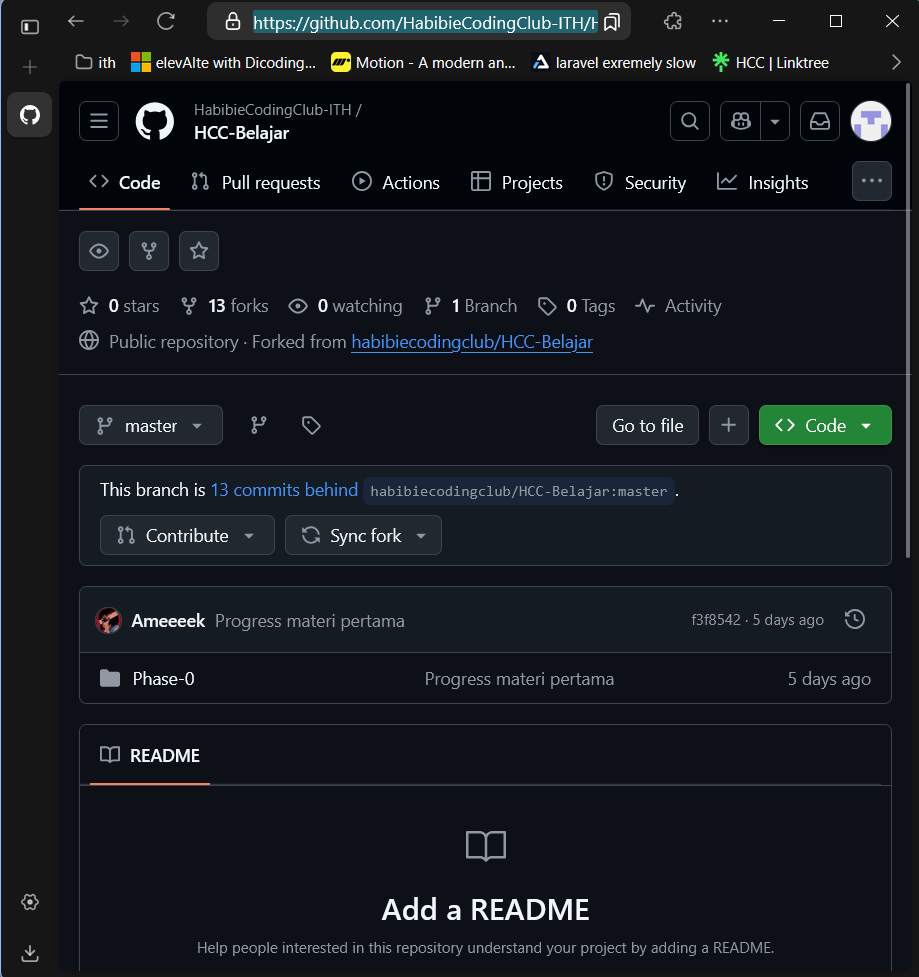

setelah melakukan sync fork repository akan mengupdate secara otomatis 

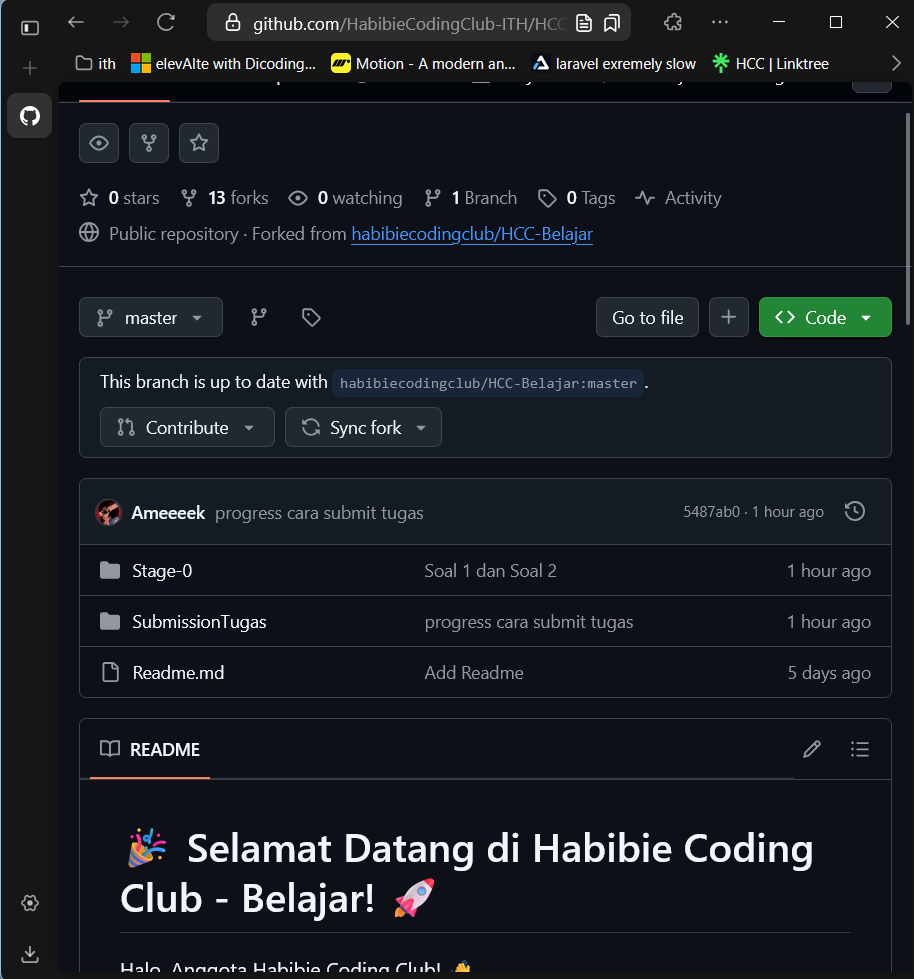

apabila telah melakukan langkah langkah diatas, waktunya untuk lanjut ke konfigurasi git pada laptop kalian.

## Konfigurasi Github
Pertama, pastikan kalian telah melakukan konfigurasi git profile di local kalian, pastikan username dan emailnya sesuai dengan email dan username github kalian, jalankan command ini di terminal/cmd kalian
```
git config --global user.name "Username github" 
git config --global user.email "emailgithub@gmail.com"
```

contoh 

```
git config --global user.name "HabibieCodingClub-ITH"
git config --global user.email "habibiecodingclub@gmail.com"
```

setelah melakukan konfigurasi git di laptop, silahkan untuk mendownload file dari repo kalian menggunakan command berikut 
```
git clone <link_repo> -> mendownload repo github kalian
cd <folder_repo> -> pindah ke direktori repository yang telah di clone
```

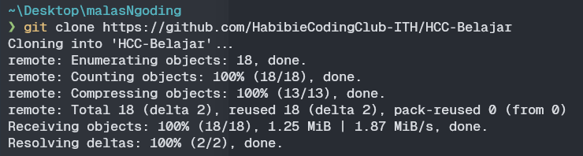

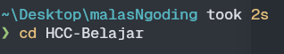

pastikan untuk file yang telah di download dari repo di github itu sesuai dengan apa yang ada di laptop kalian dengan menggunakan perintah `ls`

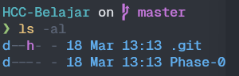
karena file disini tidak sesuai dengan yang ada di repo, maka ikuti langkah berikut ini

ketikkan command: 
```
git merge origin master -> mendownload file ada pada github
```

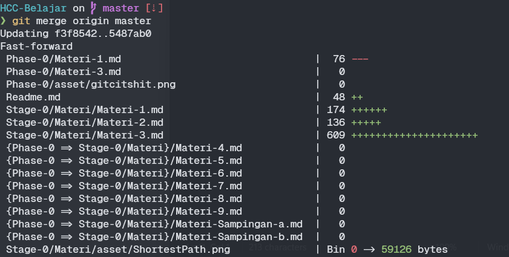

## ⚠️ JANGAN PERNAH MERUBAH ISI DARI FOLDER MATERI, DAN HANYA MENGUBAH FILE DALAM FOLDER SUBMISSIONTUGAS DAN TUGAS 

setelah semua file telah sesuai, saatnya buka vscode. 
Buka folder SubmissionTugas, dan buat file tugas didalamnya.
contoh:
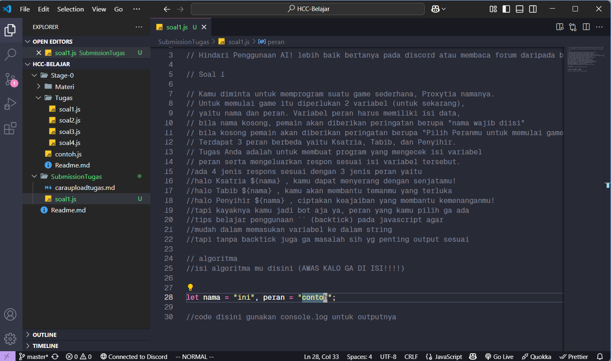
setelah melakukan perubahan atau telah menyelesaikan tugas silahkan ketikkan command berikut:

```
git add . -> melakukan penambahan perubahan ke staging 
git commit -m "pesan" -> memasukkan perubahan staging ke dalam hashcode (commit)
git push origin main -> push commit ke dalam branch main (fork repo)
```
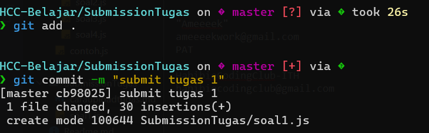
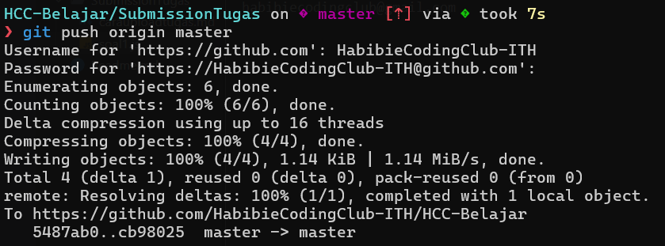

setelah mengetikkan command tersebut, silahkan buka github dan akan muncul file yang telah di upload 

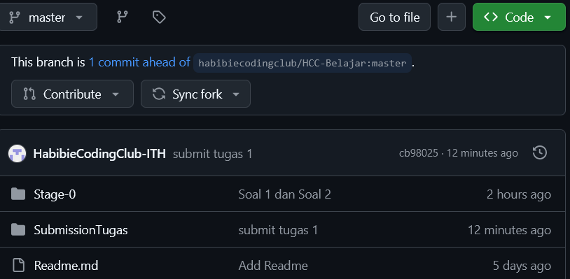

Dengan ini file telah terupload di repository kalian, untuk melakukan submit tugas silahkan lakukan pull request ke repository utama agar kode kalian dapat di cek, dengan cara menekan tombol contribute dan membuka pull request di repository kalian

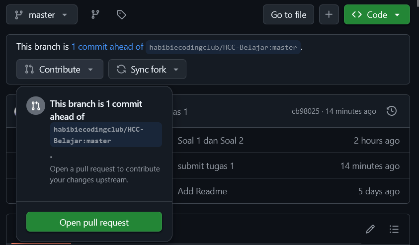
tekan tombol pull request dan tugas kalian telah tersubmit. 
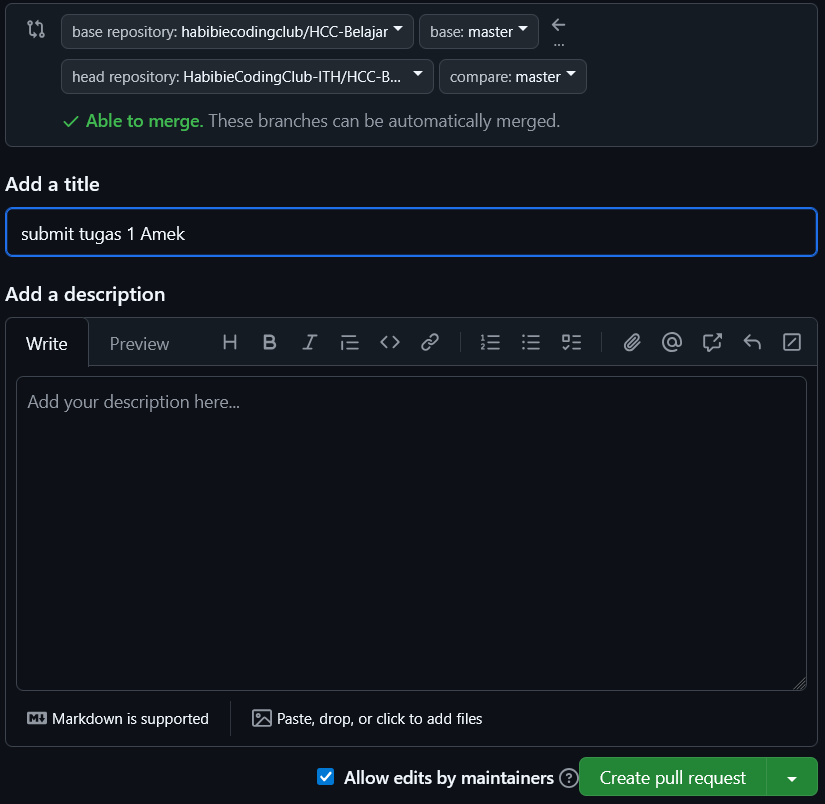

cara diatas memang agak belibet dan rumit, tapi dengan segala kerumitan ini teman-teman akan terbiasa dengan flow atau alur pada github. 

Video cara submit akan ada pada video penyelesaian soal 1 